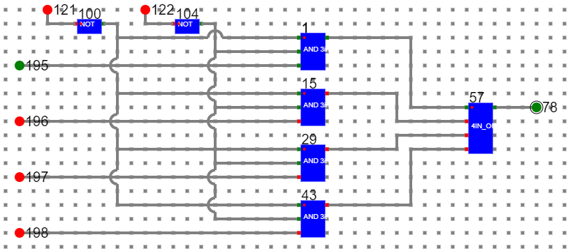

# Components :

To build a associative Cache with 4 bit memory address and 2 bit data address without any replacement policy, we need :

1. Decoder with enable and decoder without enable
2. Multiplexer with enable and multiplexer without enable
3. Single bit memory elements
4. XOR gates, NOR gates, AND gates
5. Bit switches to give inputs
6. Display units to check the outputs.
7. Wires to connect.

# Circuit of 4:1 Multiplexer:

- Follow the below manual and perform the experiment
    - Manual --> [Click Here](./simulation/coavlNew.pdf)

<embed src="./simulation/coavlNew.pdf" type="application/pdf">

