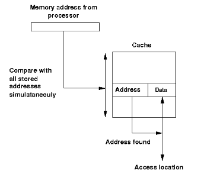
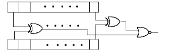

## Theory:

Design of Associative Cache:

Cache memory is a small (in size) and very fast (zero wait state) memory which sits between the CPU and main memory. The notion of cache memory actually rely on the correlation properties observed in sequences of address references generated by CPU while executing a programm(principle of locality).When a memory request is generated, the request is first presented to the cache memory, and if the cache cannot respond, the request is then presented to main memory.

- **Hit:**  a cache access finds data resident in the cache memory
- **Miss:** a cache access does not find data resident, so it forces to access the main memory.

Cache treats main memory as a set of blocks.As the cache size is much smaller than main memory so the number of cache lines are very less than the number of main memory blocks. So a procedure is needed for mapping main memory blocks into cache lines.cache mapping scheme affects cost and performance. There are three methods in block placement-

- **Direct Mapped Cache**
- **Fully Associative Mapped Cache**
- **Set Associative Mapped Cache**

## Associative Cache

Any main memory block can mapped into any cache line. main memory address is divided into two groups which are tags and word bits. Words are low-order bits and identifies the location of a word within a block and tags are high-order bits which identifies the block.

Block diagram of a associated cache :

If a miss occur CPU bring the block from the main memory to the cache, if there is no free block in the corresponding set it replaces a block and put the new one. CPU uses different replacement policies to decide which block is to replace. The disadvantage of the associative cache is its high cost for implementing parallel tag comparison, but suffer the most from thrashing due to the 'conflict misses' giving more miss penalty.

**Design Issues:**

No replacement policy has been implemented in the experiment.

The comparator Circuit through which tag is compared with specified bits of address:

